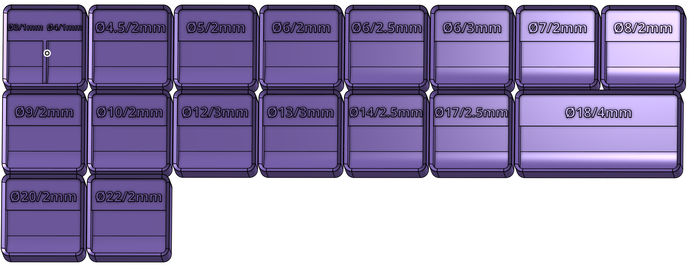
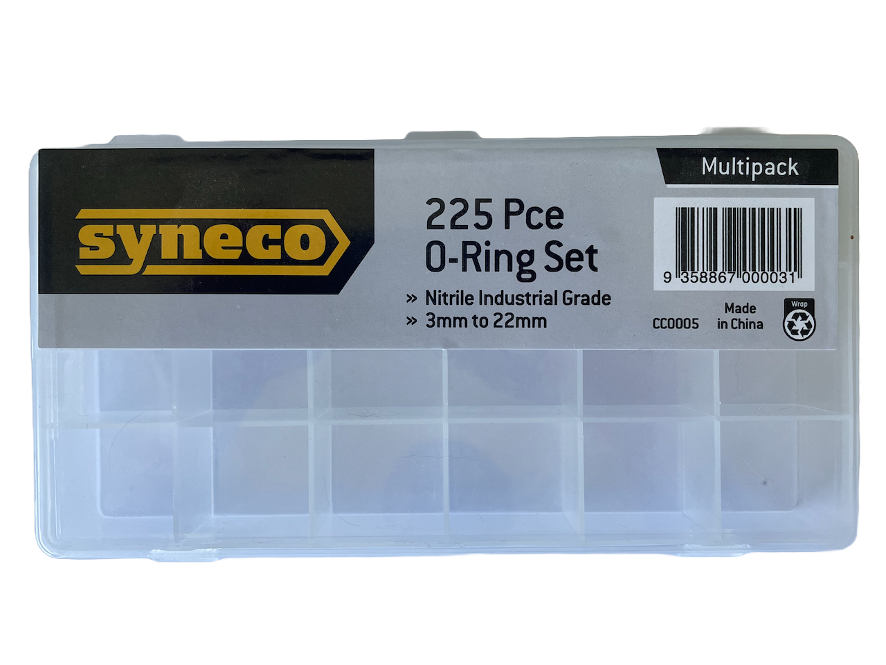

# O-Ring Organiser

This is a set of [Gridfinity](https://gridfinity.wiki) bins for sorting my metric o-ring collection. You can find the design files in [Onshape](https://cad.onshape.com/documents/d70f8d4f6b6d61eeed93b8b2/w/cb73e52aaadf4ac7d9fc570e/e/baf637fae9184124bb6a3370).

## Where to buy

I got this generic pack of o-rings from my local hardware store. I'm sure Bezos has a few lying around, but try and support your local business!

## Labels

If you're using the STL, the bin labels will all be in the base colour you're printing with. To change this colour, I used Bambu Slicer's "Color Painting" option with the tool type set to "Fill".
