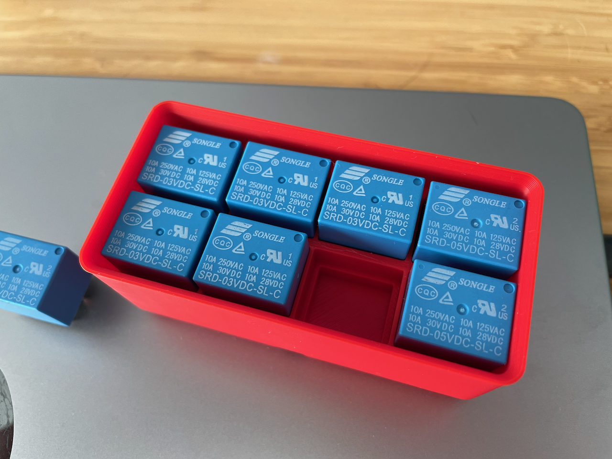

# Relay Organiser

This is a set of [Gridfinity](https://gridfinity.wiki) trays and bins for sorting my relays. You can find the design files in [Onshape](https://cad.onshape.com/documents/676c64352eea490f3992621d/w/33763ae5767ad5ea1a28eaf8/e/aaafd62aaa438bc7ae2271be).

### Trays

### Bins

## Please Note

The fit of these relays in the tray is snug! This is necessary to fit 8 relays in a 2x1 tray. If that's an issue, print the 2x2 tray, which affords more finger room.

## Labels

If you're using the STL, the bin labels will all be in the base colour you're printing with. To change this colour, I used Bambu Slicer's "Color Painting" option with the tool type set to "Fill".
